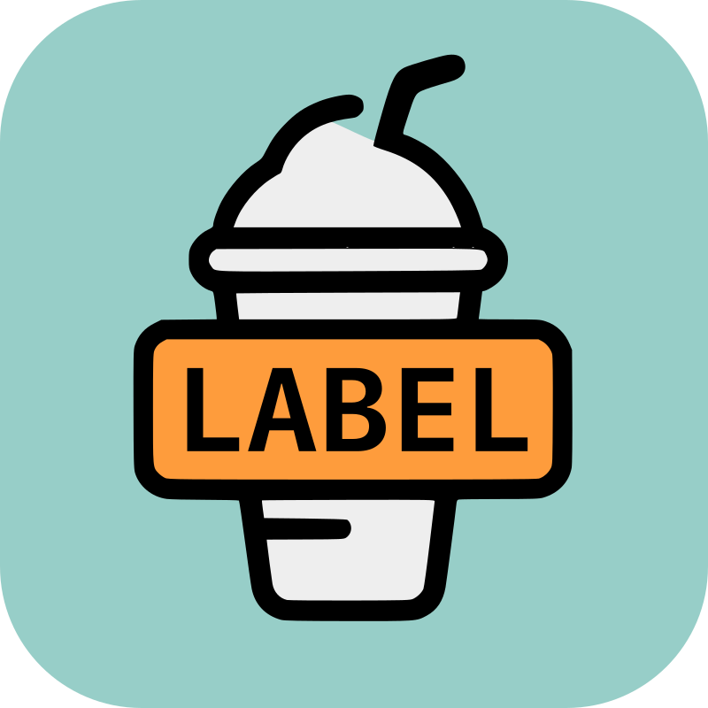

# Label Maker App for Frappe/ERPNext

<!-- add logo -->

  

A specialized Frappe/ERPNext application designed for efficient label generation and printing in retail environments.

Built as a custom solution for small grocery stores, this app streamlines the process of creating and printing product labels with support for barcodes, pricing information, and audio feedback.

## Features
- Generates item labels with barcode and pricing information
- Currently supports 32 mm x 57 mm label size (Dymo Medium label)
- Designed for retail environments, specifically tested in a small grocery store setting
- Compatible with silent (kiosk) printing for streamlined operations
- Local barcode and Datamatrix generation (no external API calls required)
- Google Text-to-Speech API integration for audio price announcements
- User-friendly modal interface for weighted item labeling
- Barcode scanner support via WebSocket connection

## Planned Improvements / In Progress
- **QZ Tray Integration**: Implement QZ Tray support for better printer management and direct printing capabilities
- **Dynamic Label Templates**: Replace hardcoded templates with configurable, user-defined label layouts
- **Multi-size Support**: Add support for various label sizes beyond the current 32 mm x 57 mm format
- **Template Designer**: Create a visual template designer for customizing label layouts
- **Printer Profiles**: Support multiple printer configurations and profiles
- **Custom Fields Mapping**: Allow users to map custom fields to label elements
